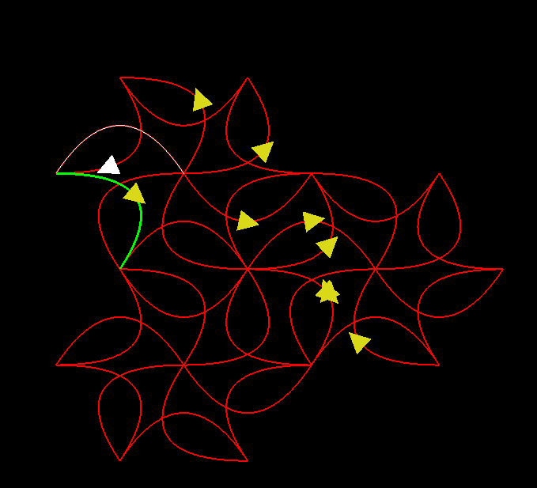

# Labirinto de Curvas Bezier

Este é um projeto em OpenGL que implementa um labirinto de curvas Bezier. Nele, você controla uma seta branca que se move constantemente. Você pode fazer a seta parar pressionando a tecla 'x' e trocar a direção da seta pressionando a tecla 'z'. Além disso, quando a seta estiver na metade da curva Bezier, você pode trocar para a próxima curva utilizando as teclas de direcionais.

## Pré-requisitos

Certifique-se de ter os seguintes requisitos instalados em seu ambiente de desenvolvimento:

- OpenGL
- Xcode

## Comandos do jogo

- Pressione 'x' para fazer a seta parar.
- Pressione 'z' para trocar a direção da seta.
- Utilize as teclas de direcionais para trocar para a próxima curva Bezier.

## Exemplo

Aqui está um exemplo do labirinto de curvas Bezier em ação:

Neste exemplo, a seta branca está navegando pelo labirinto de curvas Bezier, controlada pelo usuário.
